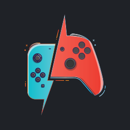

# VITA-MOONLIGH-PLUS

Cliente Moonlight para PlayStation Vita que permite la transmisión de juegos desde tu PC a tu consola portátil.

## 🚀 Características

- Interfaz de usuario optimizada para pantalla táctil y controles de la PS Vita
- Soporte para transmisión de juegos en 720p
- Baja latencia para una experiencia de juego fluida
- Integración con Moonlight Game Streaming
- Interfaz basada en Borealis, un framework de interfaz de usuario moderno

## 📦 Requisitos

- PlayStation Vita con firmware 3.60 o superior
- Custom Firmware instalado (H-encore, Henkaku, etc.)
- Conexión de red estable (se recomienda 5GHz WiFi)
- PC con GPU compatible con NVIDIA GameStream
- Aplicación Moonlight instalada en el PC host

## 🛠️ Instalación

1. Asegúrate de tener instalado el Vitashell en tu PS Vita
2. Copia el archivo `borealis_demo.vpk` a tu PS Vita
3. Instálalo usando Vitashell
4. Ejecuta la aplicación desde el LiveArea

## 🔧 Compilación

### Requisitos previos

#### Para compilar para PS Vita:
- **Docker**
  - Versión 20.10 o superior
  - Requiere permisos de superusuario (sudo) o pertenecer al grupo 'docker'
  - Instalación:
    - [Guía de instalación para Linux](https://docs.docker.com/engine/install/)
    - [Guía de instalación para Windows](https://docs.docker.com/desktop/windows/install/)
    - [Guía de instalación para macOS](https://docs.docker.com/desktop/mac/install/)

- **Git**
  - Última versión estable recomendada
  - [Descargar Git](https://git-scm.com/downloads)

#### Para compilar para Windows (en Ubuntu):
```bash
# Instalar las herramientas de compilación cruzada para Windows
sudo apt update
sudo apt install -y g++-mingw-w64-x86-64 gcc-mingw-w64-x86-64 mingw-w64-tools

# Durante la instalación, seleccionar "posix" cuando se solicite
# (Seleccionar la opción 1: x86_64-w64-mingw32)

# Instalar herramientas adicionales necesarias
sudo apt install -y cmake make pkg-config
```

### Compilación para PS Vita

1. Clona el repositorio:
   ```bash
   git clone https://github.com/AorsiniYT/VITA-MOONLIGH-PLUS.git -b vita
   cd VITA-MOONLIGH-PLUS
   ```

2. Ejecuta el script de compilación:
   ```bash
   chmod +x makepsv
   ./makepsv
   ```

   El archivo VPK generado estará disponible en la carpeta `build/`.

### Compilación para Windows

1. Asegúrate de tener instaladas todas las dependencias mencionadas arriba.

2. Ejecuta el script de compilación:
   ```bash
   chmod +x makewin
   ./makewin
   ```

   El ejecutable generado estará disponible en la carpeta `build_mingw/`.

3. Sigue las instrucciones en pantalla para instalar y ejecutar la aplicación en tu PS Vita

## 🎮 Uso

1. Asegúrate de que tu PC esté encendida y con Moonlight configurado
2. Inicia la aplicación en tu PS Vita
3. Selecciona tu PC de la lista de dispositivos disponibles
4. ¡Disfruta de la transmisión de juegos!

## 📚 Documentación Adicional

Para más información sobre el desarrollo para PS Vita con Borealis, consulta:

- [Guía de Borealis para PS Vita](https://github.com/xfangfang/borealis/wiki/PS-Vita) - Instrucciones detalladas de configuración y desarrollo
- [Documentación avanzada de Borealis](https://gist.github.com/xfangfang/305da139721ad4e96d7a9d9a1a550a9d) - Información técnica detallada sobre el framework

## 📝 Notas

- Para obtener el mejor rendimiento, se recomienda una conexión de red cableada en el PC
- Ajusta la configuración de calidad en la aplicación según tu conexión
- Algunos juegos pueden requerir configuración adicional en el PC host

## 🤝 Contribución

Las contribuciones son bienvenidas. Por favor, lee las pautas de contribución antes de enviar cambios.

## 📄 Licencia

Este proyecto está bajo la Licencia Apache 2.0. Ver el archivo [LICENSE](LICENSE) para más detalles.

## 🙏 Créditos

Este proyecto utiliza los siguientes proyectos de código abierto:

- [Borealis](https://github.com/xfangfang/borealis) - Biblioteca de interfaz de usuario para aplicaciones Nintendo Switch, PS4, PSVita y más.
- [VitaSDK](https://github.com/vitasdk/vdpm) - Kit de desarrollo de software para PlayStation Vita.
- [PVR_PSP2](https://github.com/GrapheneCt/PVR_PSP2) - Módulos PVR para PlayStation Vita.

---

Desarrollado con ❤️ para la comunidad de PS Vita